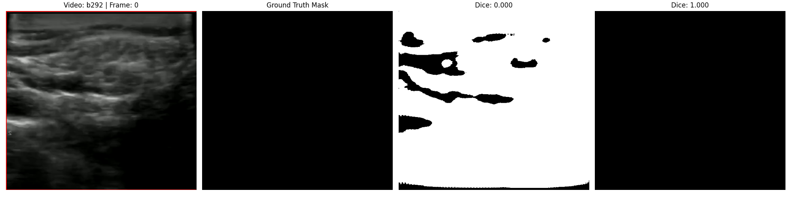
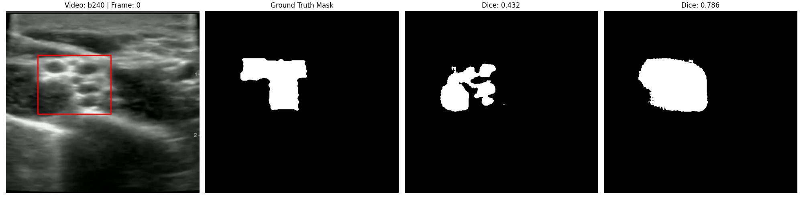

# Physics-Informed MedSAM: Acoustic Attenuation for Clinical Ultrasound

An augmented foundation model architecture that integrates the physical laws of acoustics—specifically acoustic attenuation geometry—into the Medical Segment Anything Model (MedSAM). This modification drastically improves segmentation accuracy and eliminates clinical hallucinations caused by acoustic shadows on real-world ultrasound video.

---

## The Problem: Shadow Hallucination in Foundation Models
Standard vision foundation models (such as ViT-B in MedSAM) treat medical ultrasound scans purely as arrays of pixel intensities, ignoring the physical mechanism of how sound waves generate the image. This leads to a critical failure in clinical applications:

**Acoustic Shadowing:** Dense tissues (like bone or thick fascia) cause massive acoustic energy drop-offs, leaving dark voids in the ultrasound scan. Because standard models have no physical context for signal loss, they aggressively hallucinate false anatomical boundaries inside these empty shadows.

This project solves this issue via a custom Physics-Informed Neural Network (PINN) integration.

---

## The Solution: The Acoustic Attenuation Layer
To resolve the visual artifact of acoustic shadowing, a custom `AcousticAttenuationLayer` was engineered and injected directly into the mask decoder upscaling blocks of MedSAM.

Instead of guessing the semantics of black pixels, this layer actively models the physical loss of ultrasound signal along the depth axis (the Beer-Lambert Law) via a learned cumulative transmission map:

$$T_{\text{cumulative}}(y) = \prod_{i=0}^{y} (1 - A_i)$$

Where $A$ is the learned absorption fraction of the tissue at a given pixel. This mathematically simulates the exact mechanism that causes acoustic shadows, effectively teaching the model to dynamically suppress signals and correctly identify noise when looking "behind" dense objects.

---

## Visual Comparisons

Below are examples of the PINN architecture outperforming the baseline foundation model on clinical data.

**Hallucination Resistance (True Negatives)**
*In frames where the target anatomy is missing, Baseline MedSAM aggressively hallucinates false positives. The Physics-Informed model correctly outputs a blank mask (Dice: 1.000).*


**Visible Anatomy Segmentation (True Positives)**
*When anatomy is present but obscured by acoustic noise, the PINN maps the true boundaries more accurately by actively calculating signal attenuation.*


---

## Real-World Clinical Results
The PINN architecture was evaluated head-to-head against Baseline MedSAM on **40,200 continuous video frames** across three commercial ultrasound datasets (eSaote, Butterfly, Sonosite).

### Isolated Performance Diagnostic (Butterfly Dataset)
To ensure the model was not simply suppressing all outputs globally, metrics were strictly separated into True Positives (anatomy is visible) and True Negatives (empty ground truth).

**Visible Anatomy Performance (True Positives)**
* Baseline MedSAM Dice: 0.6424
* **PINN MedSAM Dice:** **0.6905** *(Superior anatomical mapping despite shadowing)*

**Hallucination Resistance (True Negatives)**
* Baseline MedSAM Dice: 0.0000 *(Hallucinated on 100% of empty frames)*
* **PINN MedSAM Dice:** **1.0000** *(Zero hallucinations; correctly output blank masks)*

---

## Running the Evaluation
To run the split diagnostic evaluation locally:
```bash
python compare_models1.py
